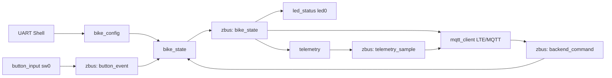

# Architecture

This document defines the target firmware architecture for the Bikeshare Firmware MVP.

## Design Goals

- Keep hardware control, state transitions, backend communication, and telemetry separated.
- Use Zephyr subsystems where they directly support the coursework goals.
- Keep button interrupt handling minimal.
- Make the state machine deterministic and easy to test with ZTEST.
- Keep LTE/MQTT and GNSS failures from corrupting local trip state.

## Module Layout

Modules:

| Module | Responsibility |
| --- | --- |
| `bike_config` | Load, validate, save, and expose persisted settings. |
| `bike_shell` | Provides setup, state diagnostic, and local simulation shell commands. |
| `app_channels` | Defines zbus channels and shared message types. |
| `bike_state` | Owns the authoritative state machine and rental context. |
| `button_input` | Reads the physical button through `sw0` and publishes button events. |
| `led_status` | Observes bike state and drives the LED pattern through `led0`. |
| `mqtt_client` | Manages LTE/MQTT connectivity, subscribes to backend commands, and publishes telemetry/events. |
| `telemetry` | Produces periodic telemetry samples, including state, uptime, LTE status, trip data, and best-effort GNSS. |

## Data Flow



## zbus Channels

The MVP uses four logical channels:

| Channel | Publisher | Subscribers | Purpose |
| --- | --- | --- | --- |
| `button_event` | `button_input` | `bike_state` | Reports physical button presses. |
| `backend_command` | `mqtt_client`, shell simulation | `bike_state` | Carries backend rental commands. |
| `bike_state` | `bike_state` | `led_status`, `telemetry`, `mqtt_client` | Publishes authoritative state changes. |
| `telemetry_sample` | `telemetry` | `mqtt_client` | Publishes periodic telemetry samples. |

Message contents are implemented as compact C structs in `app/include/app_channels.h`. The current channel scaffolding covers button events, backend commands, state publications, and telemetry samples; button/backend/state are actively used by implemented modules, `button_input` publishes button events, and `led_status` observes the state channel.

## State Machine

Authoritative firmware states:

| State | Meaning |
| --- | --- |
| `UNREGISTERED` | Required configuration is missing or invalid. |
| `AVAILABLE` | Bike is configured, initialized, and available for rental. |
| `RESERVED` | Backend authorized a rental, but the trip has not started yet. |
| `IN_USE` | A trip is active. |
| `ERROR` | Firmware detected an unrecoverable fault that blocks normal operation. |

`LOCKED` and `UNLOCKED` are not authoritative firmware states in this design. They can be treated later as derived physical lock/output states if a lock actuator is added.

## Boot Rule

After settings are loaded:

- Missing or invalid `id`, `device_token`, `mqtt_host`, `mqtt_port`, or `apn` leaves the bike in `UNREGISTERED`.
- Valid configuration plus successful initialization moves the bike to `AVAILABLE`.
- Unrecoverable initialization failure moves the bike to `ERROR`.

## State Transitions

| Current state | Event | Guard | Next state | Side effects |
| --- | --- | --- | --- | --- |
| `UNREGISTERED` | Valid configuration loaded or saved | All required settings valid and initialization succeeds | `AVAILABLE` | Publish state, update LED, allow MQTT operation. |
| `UNREGISTERED` | Button press | Always | `UNREGISTERED` | Log ignored press. |
| `UNREGISTERED` | `RENT_AUTHORIZE` | Always | `UNREGISTERED` | Warn and reject because bike is not configured. |
| `AVAILABLE` | `RENT_AUTHORIZE` | Command contains a valid `rental_id` | `RESERVED` | Store `rental_id`, start 60 second reservation timeout, publish event. |
| `AVAILABLE` | Button press | Always | `AVAILABLE` | Log ignored press because backend authorization is required. |
| `AVAILABLE` | `RENT_CANCEL` | Always | `AVAILABLE` | Warn and reject because no reservation is active. |
| `RESERVED` | Button press | Reservation still active | `IN_USE` | Start trip timer, publish trip-start event. |
| `RESERVED` | `RENT_CANCEL` | `rental_id` matches active reservation | `AVAILABLE` | Clear `rental_id`, cancel timeout, publish cancellation event. |
| `RESERVED` | Reservation timeout | 60 seconds elapsed without trip start | `AVAILABLE` | Clear `rental_id`, publish timeout/cancellation event. |
| `RESERVED` | Duplicate or mismatched `RENT_AUTHORIZE` | Always | `RESERVED` | Warn and reject without state change. |
| `IN_USE` | Button press | Always | `AVAILABLE` | Stop trip timer, publish trip-ended event, clear `rental_id`. |
| `IN_USE` | `RENT_CANCEL` | Always | `IN_USE` | Warn and reject because active trips are ended locally by button in the MVP. |
| `IN_USE` | MQTT disconnect | Always | `IN_USE` | Continue local trip state and reconnect in background. |
| Any non-error state | Unrecoverable firmware fault | Fault detected | `ERROR` | Publish/log error and switch LED pattern. |
| `ERROR` | Button press | Always | `ERROR` | Log ignored press. |
| `ERROR` | Reboot or shell diagnostic retry | Fault cleared and initialization succeeds | `AVAILABLE` or `UNREGISTERED` | Re-evaluate configuration and initialization. |

Invalid backend commands must not force state transitions. They should be logged with `LOG_WRN` and may publish a rejection/error event.

## Button Behavior

The physical button is the local trip control:

- In `RESERVED`, a short press starts the trip and enters `IN_USE`.
- In `IN_USE`, a short press ends the trip and returns to `AVAILABLE`.
- In `UNREGISTERED`, `AVAILABLE`, and `ERROR`, a short press is ignored and logged.

The GPIO interrupt callback must not run state-machine logic directly. It should submit work that debounces the press and publishes `button_event` to zbus.

## LED Behavior

The MVP uses one onboard LED through the `led0` devicetree alias.

| State | LED pattern |
| --- | --- |
| `UNREGISTERED` | Off |
| `AVAILABLE` | Slow blink |
| `RESERVED` | Fast blink |
| `IN_USE` | Solid on |
| `ERROR` | SOS/error pattern |

The LED module observes the `bike_state` channel. It must not own or modify state.

## MQTT Integration

The firmware communicates with a Mosquitto broker over LTE.

Topics:

```text
bikes/{bike_id}/telemetry
bikes/{bike_id}/events
bikes/{bike_id}/commands
```

Topic intent:

- `telemetry`: periodic status samples.
- `events`: discrete trip/state events such as reservation, trip start, trip end, errors, and boot/online events.
- `commands`: backend-to-bike commands such as `RENT_AUTHORIZE` and `RENT_CANCEL`.

Authentication:

- MQTT client ID: `bike_id`.
- MQTT password/token: `device_token`.
- TLS is recommended for production but optional for the coursework demo unless certificate provisioning is implemented.

## Telemetry

Telemetry should include:

- Bike ID.
- Current state.
- `uptime_ms` as the required timestamp basis.
- LTE registration and signal information when available.
- Active `rental_id` when the bike is `RESERVED` or `IN_USE`.
- Trip duration when the bike is `IN_USE`.
- Best-effort GNSS fields when a valid fix exists.
- An explicit no-fix indication when GNSS is unavailable.

GNSS must not block trips, state transitions, MQTT connection, or the class demo.

## Execution Model

- `button_input` uses a GPIO interrupt only to detect the edge and schedule work.
- Scheduled button work debounces physical presses before publishing `button_event`.
- `bike_state` subscribes to `button_event` and `backend_command` and owns all state transitions.
- `bike_shell` can publish simulated backend commands and button events for native-simulation demos.
- `led_status` observes `bike_state` and runs blink timing through Zephyr timers/work.
- `telemetry` runs periodically through a work item or thread.
- `mqtt_client` owns the LTE/MQTT connection loop, command subscription, publish retries, and reconnect behavior.
- LTE/MQTT disconnects do not move an active trip to `ERROR`; local state continues and the MQTT client retries in the background.

## Configuration Layout

Recommended project configuration layout:

- Common Zephyr subsystem options live in `app/prj.conf`.
- `native_sim` TAP networking and static IP settings live in `app/boards/native_sim.conf` and `app/boards/native_sim_native_64.conf`.
- nRF9160 DK hardware persistence, GPIO, UART shell, and generic MQTT/network library scaffolding live in `app/boards/nrf9160dk_nrf9160_ns.conf`.
- The nRF9160 settings partition is selected in `app/boards/nrf9160dk_nrf9160_ns.overlay`.
- NCS-specific LTE modem and GNSS options should be added to the nRF9160 board configuration when the manifest moves from upstream Zephyr to NCS.

This avoids mixing hardware modem options with host-simulation options.
